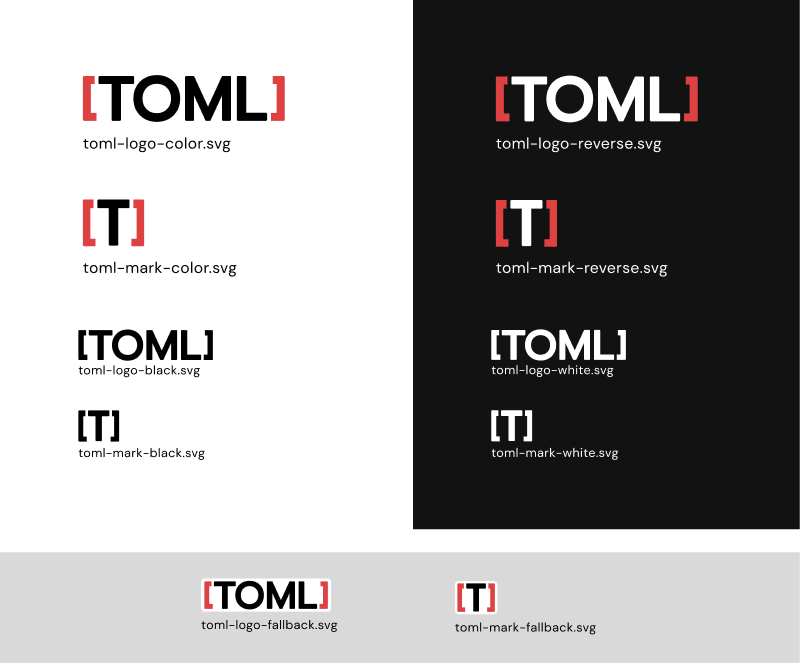
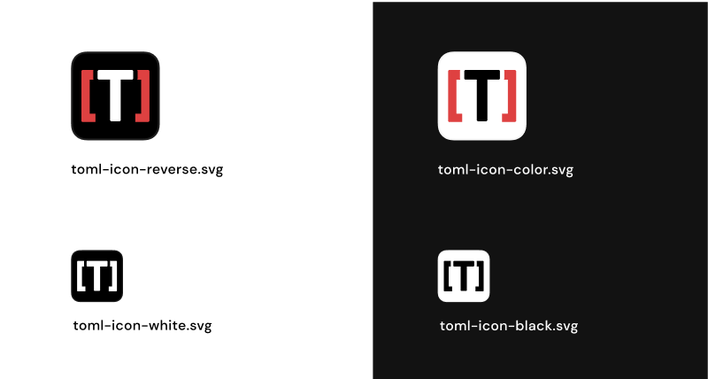
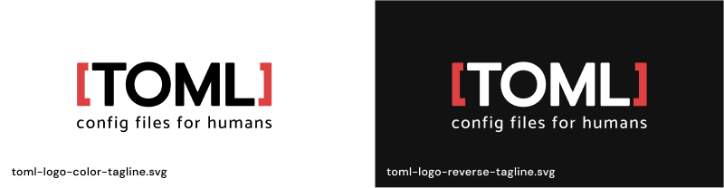

# TOML logos

## Logos and marks

TOML's graphic material consists of the logo showing the name TOML in full and
the mark showing only the letter T. The logo was designed to be used wherever
display space is not limited. The mark was designed to be used in place of the
logo when display space is limited or when it specifically refers to a TOML
file.

The color versions are intended for a white background, while the reverse
versions are intended for a black background. The fallback versions were
designed for when the background cannot be controlled, such as in GitHub
`README.md` files where the background depends on the user's dark or light theme
preferences.

## Icons

The icons are intended to be used as favicons.

## Tagline

The tagline "config files for humans" is intended to be used in conjuction with
the logo on headers, footers, or any other place where the logo can be displayed
in large format (to preserve the visibility of the tagline).

# Colors

In addition to `#FFFFFF` (white) and `#000000` (black), the logos, marks and
icons use the color `#DE4141`.

# License

The logos, marks, icons and tagline in this page and repository were created by
@1984logo in May 2022.

This work by [@1984logo](https://github.com/1984logo) is licensed under
[CC BY 4.0](http://creativecommons.org/licenses/by/4.0/?ref=chooser-v1).
